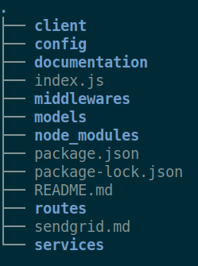
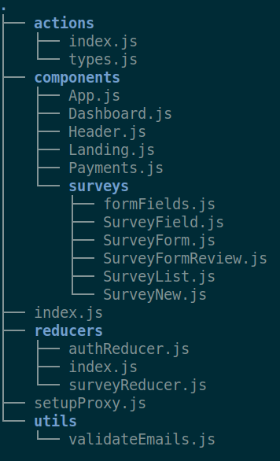

# Project Structure


[toc]


## Overview

> client folder **inside** server folder in order to run concurrently both services with a **single command**

To start, run the following command inside the root folder (i.e. project)

```
npm run dev
```





## Client

``` 
/server/config
```




```bash
googleClientID: process.env.GOOGLE_CLIENT_ID,
googleClientSecret: process.env.GOOGLE_CLIENT_SECRET,
mongoURI: process.env.MONGO_URI,
cookieKey: process.env.COOKIE_KEY,
stripePublishableKey: process.env.STRIPE_PUBLISHABLE_KEY,
stripeSecretKey: process.env.STRIPE_SECRET_KEY,
sendGridKey: process.env.SEND_GRID_KEY,
mailFrom: process.env.MAIL_FROM,
redirectDomain: process.env.REDIRECT_DOMAIN,
```


## Heroku

## Sendgrid

## Google Cloud Platform

## MongoDB Atlas